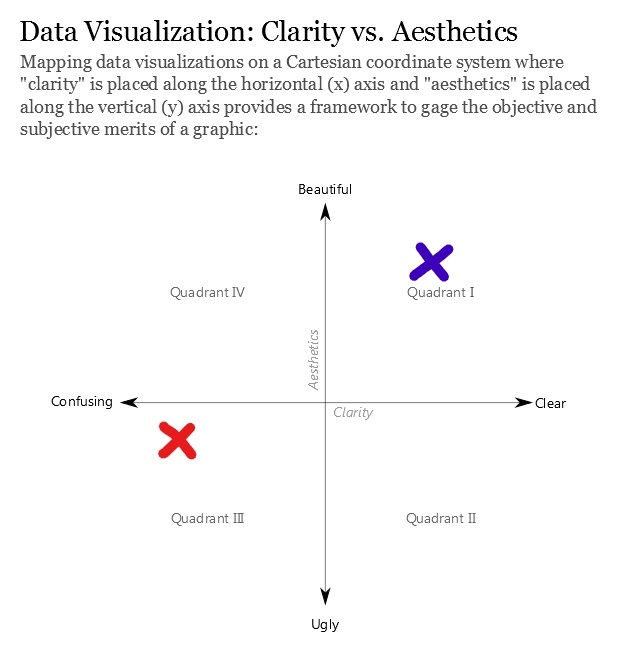
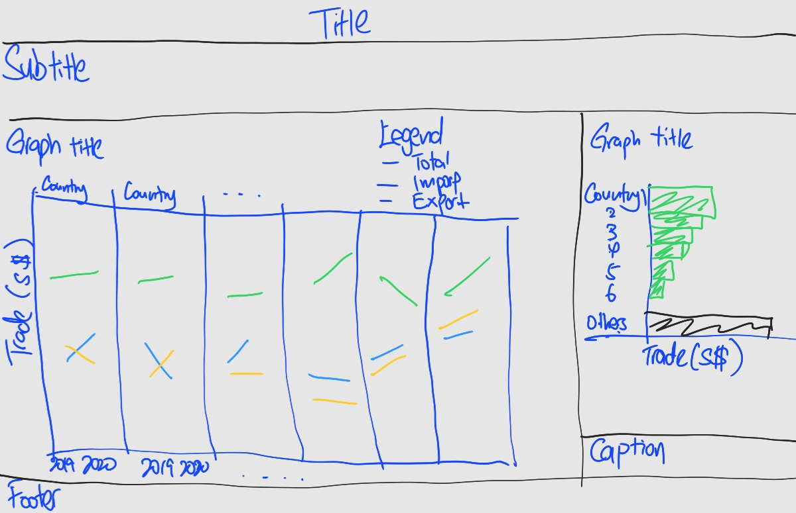

```{r setup, include=FALSE}
knitr::opts_chunk$set(echo = TRUE)
```
# The original Visualisation

Figure \@ref(fig:original-visualisation) below shows the original visualisation for the top six trading countries with Singapore in 2019 to 2020 using the data provided by Department of Statistics, Singapore (DOS).

```{r original-visualisation, layout="l-page", fig.align = 'center', fig.cap = 'Original Visualisation', echo=FALSE}
knitr::include_graphics("img/org_visual.png")
```

# 1. Critiques for the original visualisation
Before looking at the visualisation aesthetics and clarity, it is important to have a clear understanding of  the context and objective of the visualisation. 

What does merchandise trade constitutes?

* Merchandise Trade is the combination of imports and exports.
    + Imports refers to goods brought into Singapore.
    + Exports refers to good brought out of Singapore.
* How are the top six trading countries with Singapore selected?
    + They are selected based on their total summation of imports and exports for year 2020.
* How do we measure merchandise trade?
    + Merchandise trade is measured in Singapore Dollars (S$).

## 1.1 Clarity of Visualisation
Clarity is the visualisation **"Fit"**: How the visualisation matches and tell reality.

### 1.1.1 Good points in the visualisation to be kept
1. Plotting the graph over time provides temporal information.
2. Graph was plotted with "Export" and "Import" data.

### 1.1.2 Areas to be improved
1. Title of visualisation did not mention who the six countries are trading with.
2. Subtitle can be added to provide more context and information for the visualisation, such as how the top six countries are selected, which year is used for the calculation and the unit of measurements.
3. Lack of aggregated data that determined the ranking and selection of the top six countries.
4. Ranking of the countries could present valuable information for the visualisation.
5. No caption is included to reference the source of data.
6. Different axis intervals and range giving the wrong visual perception:
    + Inter-plot x-axis intervals and range are different. Japan plot has a different time period as compared to the other countries.
    + Inter-plot y-axis intervals and range for import and exports are different, making it difficult to compare between the six countries.
    + Y-axis label is confusing. The "M" was not explained.
7. Merchandise trade can be seasonal and it fluctuates heavily by month. A condensed time frame might be more useful for the visualiation. 

## 1.2 Aesthetics of Visualisation
Aesthetics is the visualisation **"Form"**: How the visualisation looks.

### 1.2.1 Good points in the visualisation to be kept
1. Individual graph for each country allows comparison between the countries.

### 1.2.2 Areas to be improved
1. Title alignment are inconsistent. 
    + Main title is skewed to the right.
    + Individual titles are skewed to the left.
    + Main title font size is smaller than individual plots title.
2. Color fill under the curve does not bring any value. Furthermore, the overlapping colors are confusing for readers to read and interpret.
3. Annotation can be added on the graphs to tell the story more effectively.

# 2. Alternative Data Visualisation
From Ben's [@clarity_aesthetics] Data Visualisation chart of Clarity vs. Aesthetics shown in Figure \@ref(fig:clarity-aesthetics), the current visualisation would fall under Quadrant III and the proposed visualisation would aim to be in Quadrant I. 

```{r clarity-aesthetics, fig.align = 'center', fig.cap = 'Aesthetics against Clarity chart', echo=FALSE}

```

To improve the visualisation, the time series could be changed to yearly instead of monthly. Merchandise trade of each country fluctuates heavily and certain goods are seasonal. Utilising a monthly interval for the x-axis clutters the graph with the line plot peak and trough that might not provide useful information. Aggregating the data into years might be clearer for interpretation for the change over year.

An additional plot can be added to summarize and rank the top 6 countries. This plot displayed will include background information that the top six country are selected based on the total trade in 2020. The bar plot can also be arranged in descending order to showcase the ranking of the six countries. 

```{r sketch, layout="l-page", fig.align = 'center', fig.cap = 'Sketch of alternative visualisation', echo=FALSE}

```

Figure \@ref(fig:sketch) would be an alternative presentation of the visualisation. 

* The title will be renamed to provide more context to understand the visualisation.
* Subtitle will be added to provide background information on the context.
* The line plot concept will be retained on the left of the visualisation.
    + The x-axis will be changed to year instead of months to aggregate the data.
    + The y-axis title to include the units of measurement (S$).
    + Line plot to be stacked horizontally with same y-axis marks for comparison of trade value between the 6 countries.
    + Additional line of total trade (sum of import and export) to be included in the graph.
* Additional horizontal bar plot to be added to the right of the visualisation.
    + The bar plot will indicate the total trade in 2020.
    + Include the title and context for the bar plot.
    + Other than the 6 country, include an additional variable *Others* to group the remaining countries.
    + Change the color for the bar plot to <span style="color:green">green</span> to align to the line plot. 
* Include caption to indicate the dataset source and date.
* Include footer if necessary to indicate any special information. 

# 3. Proposed Data Visualisation using Tableau
The dataset used was retrieved from [Deparment of Statistics Singapore](https://www.singstat.gov.sg/) under the sub-section of [Merchandise Trade by Region/Market](https://www.singstat.gov.sg/find-data/search-by-theme/trade-and-investment/merchandise-trade/latest-data). 

[Tableau Prep Builder 2021.1](https://www.tableau.com/products/prep) software is used for data preparation and [Tableau 2021.1](https://www.tableau.com/) is used for data visualisation. 


## 3.1 Data Preparation
Upload the dataset into Tableau Prep Builder.

```{r import-step1, layout="1-body-outset", fig.align = 'center', fig.cap = 'Load the Import worksheet', echo=FALSE}
knitr::include_graphics("img/dataprep/import_step1.png")
```
**Refer to Figure \@ref(fig:import-step1) to import the dataset by following the steps below.**  <br />
1. Tick the box circled in <span style="color:red">red</span> on the left. This option allows the Tableau Prep Builder to perform preliminary cleaning of the data. <br />
2. Drag the *T1* worksheet in <span style="color:orange">orange</span> into the middle box. <br />
3. Change the name in <span style="color:green">green</span> to *Import*. <br />
4. Click the + button and create a *Clean Step* node in <span style="color:purple">purple</span>. 

```{r import-step2, layout="l-body-outset", fig.align = 'center', fig.cap = 'Exclude the rows for regions', echo=FALSE}
knitr::include_graphics("img/dataprep/import_step21.png")
```

**Refer to Figure \@ref(fig:import-step2) to exclude the rows for regions and total imports by following the steps below.** <br />
1. Select the first 7 rows (*Total Merchandise Imports, America, Asia, Europe, Oceania, Africa, European Union*) in <span style="color:red">red</span> from the *Variables* column and click the *Exclude* button in <span style="color:orange">orange</span>. <br />

```{r import-step3, layout="l-body-outset", fig.align = 'center', fig.cap = 'Pivot Date into row', echo=FALSE}
knitr::include_graphics("img/dataprep/import_step3.png")
```

**Refer to Figure \@ref(fig:import-step3) to pivot the Months from the columns into rows.** <br />
1. Select the + button and create a *Pivot* node in <span style="color:red">red</span>. <br />
2. Drag all the months column header and drop to the *Pivoted Fields* section as per the <span style="color:orange">orange arrow</span>. <br />
3. Rename the column headers to *Date, Import and Country* accordingly in <span style="color:blue">blue box</span>. <br />
4. Change the data type of *Date* column to *Date* in <span style="color:green">green</span>.

```{r import-step4, layout="l-body-outset", fig.align = 'center', fig.cap = 'Clean column header and label data type', echo=FALSE}
knitr::include_graphics("img/dataprep/import_step4.png")
```

**Refer to Figure \@ref(fig:import-step4) to aggregrate the import by year** <br />
1. Select the + button and create an *Aggregate* node in <span style="color:red">red</span>. <br />
2. Drag column *Country* and *Date* and drop them in *Grouped Fields* as per the <span style="color:orange">orange arrow</span>. <br />
3. Drag column *Import* and drop it in *Aggregated Fields* as per the <span style="color:green">green arrow</span> to aggregate the sum of import by year. <br />
3. *Group* the column *Date* by *Year* following the steps in the <span style="color:blue">blue boxes</span>. <br />

**Repeat the steps from Figure \@ref(fig:import-step1) to Figure \@ref(fig:import-step4) for Export using the *T2* worksheet.**

```{r import-step5, layout="l-body-outset", fig.align = 'center', fig.cap = 'Join both tables', echo=FALSE}
knitr::include_graphics("img/dataprep/import_step51.png")
```

**Refer to Figure \@ref(fig:import-step5) to Join both table** <br />
1. Drag the *Aggregate 3* node from *T2* flow to the + button on the right of *T1* flow as shown in the <span style="color:red">red arrow</span> in Figure \@ref(fig:import-step5). <br />
2. Add two *Applied Join Clauses* to match variables *Date* and *Country* shown in <span style="color:orange">orange box</span>. <br />
3. Select the *Join Type* to *full* in the <span style="color:green">green box</span> to include all countries into the final list. <br />
4. Select the columns *Country(Country-1)* and *Date(Date-1)* and *Remove Fields* in the <span style="color:blue">blue box</span>. These are duplicate or repeated columns after performing the *Join*.  

```{r import-step6, layout="l-body-outset", fig.align = 'center', fig.cap = 'Create new column for total sum of export and import', echo=FALSE}
knitr::include_graphics("img/dataprep/import_step61.png")
```
 
**Refer to Figure \@ref(fig:import-step6) to create new column for total sum of export and import** <br />
1. Select the *Create Calculated Field* button in <span style="color:red">red</span>. <br />
2. Change the *Field Name* to *Total* in <span style="color:orange">orange</span>. <br />
3. Input the equation of *[Export] + [Import]* in <span style="color:green">green</span> and save the new column. <br />

```{r import-step7, layout="l-body-outset", fig.align = 'center', fig.cap = 'Pivot the Export, Import and Total columns', echo=FALSE}
knitr::include_graphics("img/dataprep/import_step71.png")
```
**Refer to Figure \@ref(fig:import-step7) to Pivot the columns** <br />
1. Create a new *Pivot* node in the <span style="color:red">red box</span>. <br />
2. Drag and drop the columns *Export, Import* and *Total* into the *Pivoted Fields* in <span style="color:orange">orange</span>. <br />

```{r import-step8, layout="l-body-outset", fig.align = 'center', fig.cap = 'Output into csv', echo=FALSE}
knitr::include_graphics("img/dataprep/import_step81.png")
```

**Refer to Figure \@ref(fig:import-step8) to Ouput file into csv** <br />
1. Create a new *Ouput* node in the <span style="color:red">red box</span>. <br />
2. Select the *Browse* button to change the directory and filename and change the *Output type* to *Comma Separated Values (.csv)* in <span style="color:orange">orange</span>. <br />

## 3.2 Data Visualisation
The data prepared earlier is uploaded into Tableau for Visualisation.

### 3.2.1 Create line plot for the 6 countries
The data contains all countries that trades with Singapore from 1976 to 2021. Hence, the columns *Year* and *Country* is added to the *Filter* section on the worksheet to align with the original visualisation parameters. Refer to step 1 and 2 together with Figure \@ref(fig:viz-step1) to filter the 6 countries for 2019 and 2020. <br />

```{r viz-step1, layout="l-body-outset", fig.align='center', fig.cap='Filter the Country and Year', echo=FALSE}
knitr::include_graphics("img/dataviz/filter.png")
```
1. Filter *Year* to select 2019 and 2020. <br />
2. Filter *Country* to select the 6 countries, *Mainland China, Malaysia, United States, Taiwan, Hong Kong* and *Japan*. <br />

```{r viz-lineplot-1, layout="l-body-outset", fig.align='center', fig.cap='Dual axis and sychronize of dual y-axis', echo=FALSE}
knitr::include_graphics("img/dataviz/lineplot-1.png")
```

3. Create line plot by adding *Country* and *Date* to the Columns section and two *Trade value* node to Rows section.
4. Set one *Trade value* to a Line graph and the other *Trade value* to a Shape type. Right click the second node and select *Dual Axis* and Synchronize the secondary y-axis as in Figure \@ref(fig:viz-lineplot-1). This allows the graph aesthetics to be more customisable with the size and shape. 
5. Add the *Trade type*  to the *Color* tab to separate into 3 lines: *Export*, *Import* and *Total*.
6. Change the *Total* line color to <span style="color:green">green</span> to signify the total summation of import and export.
7. Right click the the secondary dual y-axis on the right and uncheck the *Show Header* option to remove the y-axis. As the secondary y-axis is of the same interval as the primary y-axis on the left, there is no value is displaying it.
8. Rename the y-axis to *Trade Value (S$)*.
9. Change the Title of the graph to *Merchandise Trade of Top Six Trading Countries with Singapore from 2019 to 2020, (S$)*.

```{r viz-lineplot-2, layout="l-page", fig.align='center', fig.cap = 'Creating dummy variables and annotate YoY', echo=FALSE}
knitr::include_graphics("img/dataviz/lineplot-2.png")
```
10. Annotate the Year-on-Year change from 2019 to 2020 on the *Total* line to show the change in percentage. The numbers is set to <span style="color:red">red</span> to indicate negative growth and <span style="color:green">green</span> to indicate positive growth. To allow repeatability in annotating the number and colors for the dashboard, five dummy variables are created as shown in Figure \@ref(fig:viz-lineplot-2).
    + *percent+* and *percent-* to indicate the positive and negative growth year-on-year in percentage. The logic sequence is in subsection **1** in Figure \@ref(fig:viz-lineplot-2).
    + *arrow+* and *arrow+* to show an upward pointing triangle for positive growth and downward pointing triangle for negative growth respectively. The logic sequence is in subsection **2** in Figure \@ref(fig:viz-lineplot-2).
    + *Verb* to output the word **grew** or **fell** depending if the year-on-year change is positive or negative respectively. The logic sequence is in subsection **3** in Figure \@ref(fig:viz-lineplot-2). 
    + Right click the <span style="color:green">green circle</span> for Total sales in 2020 and add *Annotate -> Mark*.
    + Include the annotation description in Figure \@ref(fig:viz-lineplot-2) subsection 4. Change the color for positive change to <span style="color:green">green</span> and negative change to <span style="color:red">red</span>.
    
```{r viz-lineplot-3, layout="l-body-outset", fig.align='center', fig.cap = 'Annotate unique insights', echo=FALSE}
knitr::include_graphics("img/dataviz/lineplot-3.png")
```

11. Annotate unique insights such as strong increase or decrease of the import or export on the graph. The annotation description is shown in Figure \@ref(fig:viz-lineplot-3) and change the color similar to step 10 for *Total* change.

The final line plot is shown in Figure \@ref(fig:viz-lineplot-4).

```{r viz-lineplot-4, layout="l-page", fig.align='center', fig.cap = 'Final line plot', echo=FALSE}
knitr::include_graphics("img/dataviz/lineplot-4.png")
```

### 3.2.2 Create Bar Chart for the 6 countries in 2020
1. Create a *Bar* chart in a new worksheet

```{r viz-barchart-1, layout="l-body-outset", fig.align = 'center', fig.cap = 'Create new Variable for other countries', echo=FALSE}
knitr::include_graphics("img/dataviz/barchart-1.png")
```
2. Right click *Country* and *Create* a new *Set* as per the top left example in Figure \@ref(fig:viz-barchart-1).
3. Name the set *top6country* and select the 6 countries from the list as per the top right example in Figure \@ref(fig:viz-barchart-1).
4. In the *Analysis* toolbar, select *Create Calculated Field*.
5. Enter the logic sequence shown at the bottom of Figure \@ref(fig:viz-barchart-1) and name the variable *Others*. This creates a new variable where the 6 countries are named as usual and the other countries will be combined into the dummy variable called *Others*.
6. Filter *Date* variable to show only 2020.
7. Filter *Trade type* to show only *Total*.
8. Insert variable *Others* to the Rows and *Trade Value* to the Columns on the bar chart worksheet.
9. Insert *Others* to the Color and *Trade Value* to Label and change the calculation to *Percent of Total*. This shows the proportion of total trade value for each country over Singapore's total trade value in 2020.
10. Edit the bar colors to <span style="color:green">green</span> to align to the Line plot *Total* color. Set the *Others* to <span style="color:grey">grey</span> color to better differentiate the countries apart.
11. Change the Title to *Total Merchandise Trade of Singapore in 2020, (S$)*.
12. Change the x-axis title to *Trade Value (S$)*.

```{r viz-barchart-2, layout="l-page", fig.align = 'center', fig.cap = 'Final Bar Chart (2020)', echo=FALSE}
knitr::include_graphics("img/dataviz/barchart-2.png")
```

### 3.2.3 Create Dashboard
1. Create a new Dashboard.

```{r viz-dashboard-1, layout="l-body-outset", fig.align = 'center', fig.cap = 'Dashboard wireframe', echo=FALSE}
knitr::include_graphics("img/dataviz/dashboard-1.png")
```

2. Setup the wireframe for the dashboard by referring to Figure \@ref(fig:viz-dashboard-1) and the following steps.   
    + Change the dashboard *Size* to *Automatic* boxed in <span style="color:red">red</span> in Figure \@ref(fig:viz-dashboard-1).
    + Check the option for *Show dashboard title* boxed in <span style="color:red">red</span> to display the Title in Figure \@ref(fig:viz-dashboard-1) subsection **1**.
    + Insert *Horizontal* and *Vertical* objects as shown in Figure \@ref(fig:viz-dashboard-1) for section 2 to 6.
3. Drag and drop the line plot worksheet *Trade* to sub section 3 in Figure \@ref(fig:viz-dashboard-1).
4. Change line plot *Legend* to floating and re-position it on top of the line plot.
5. Drag and drop the bar chart worksheet *BarChart2020* to sub section 4 in Figure \@ref(fig:viz-dashboard-1).
6. Remove the *Legend* container as the country name is represented on the y-axis.
7. Change the Title of the dashboard 
8. Add subtitle to provide context for visualisation. 
9. Add caption to include source and date of data.
10. Add footer to include the metadata definition and exclusion of data.

```{r viz-dashboard-2, layout="l-page", fig.align = 'center', fig.cap = 'Final Dashboard', echo=FALSE}
knitr::include_graphics("img/dataviz/dashboard-2.png")
```

The final visualisation is available on my [Tableau Public](https://public.tableau.com/app/profile/lim.yong.kai/viz/dataviz1_16221835935250/FinalDashboard) page.

# 4.0 Insights from visualisation
There is a saying: "Statistics are like bikinis. What they reveal is suggestive, but what they conceal is vital." Visualisation should be designed to be factual and clear for interpretation.

A positive trade balance is termed when Singapore export value is greater than import value with a country. This signifies an inflow of cash to Singapore from the country. Conversely, an negative trade balance is termed when Singapore import value is greater than export value with a country. This signifies an outflow of cash from Singapore to the country.

COVID-19 was an unprecedented event in 2020 which led to countries locking down their cities or closing their borders globally and Singapore is no exception. Trade is integral to Singapore's success and the decrease in trade activities in 2020 was a major impact on it's growth. However, the makeover from the original visualisation showed meaningful insights for interpretation. 

1. The total trade value with Malaysia fell 8.4% in 2020, the largest decrease among the six countries. The Import value with Malaysia was similar for 2020 whereas the Export value took a major hit and fell by 18.2% from 2019. This resulted in a negative trade balance with Malaysia in 2020.

2. The total trade with the United States marginally fell by 2.5%. However, there was a large change in Export (grew 19.2%) and Import (fell 18.9%) in 2020. In 2019, Singapore had a negative trade balance with the United States and it was the reversed in 2020 where there was a positive trade balance.

3. Trade with Taiwan performed the best among the six countries where the total trade value grew by 13.0% in 2020. Both export and import grew significantly in 2020.

4. Hong Kong is the fifth largest trade country with Singapore among the six country. Interestingly, export value is much larger than import value where the exports value is around 90% of the total trade value. 

5. Mainland China and Japan total trade value had marginal change. Imports and exports are also consistent and equal in 2020.

6. The top six countries total trade stands at around 57% of Singapore's total trade in 2020. 

In light of COVID-19 pandemic affecting countries economy, the changes in trade might be unique in 2020. A better representation would be to use a longer time frame to show the general trend of the trade value. 