```{r setup, include=FALSE}
knitr::opts_chunk$set(echo = FALSE)
```

# The original Visualisation

Figure \@ref(fig:original-visualisation) below shows the original visualisation of the Singapore's merchandise trade performance with major trading partners in 2020 by [Department of Statistics, Singapore (DOS)](https://www.singstat.gov.sg/modules/infographics/singapore-international-trade).

```{r original-visualisation, layout="l-page", fig.align = 'center', fig.cap = 'Original Visualisation', echo=FALSE}
knitr::include_graphics("img/OG.jpg")
```

# 1. Critiques for the original visualisation
Before looking at the visualisation aesthetics and clarity, it is important to have a clear understanding of the context and objective of the visualisation.

What does merchandise trade constitutes?

* Merchandise Trade is the combination of imports and exports.
    + Imports refers to goods brought into Singapore.
    + Exports refers to good brought out of Singapore.
    + Net Importers refers to markets whose Imports is higher than Exports to Singapore.
    + Net Exporters refers to markets whose Exports is higher than Imports to Singapore.
* How do we measure merchandise trade?
    + Merchandise trade is measured in Singapore Dollars (S$).

## 1.1 Clarity of Visualisation
Clarity is the visualisation **"Fit"**: How the visualisation matches and tell reality.

### 1.1.1 Good points in the visualisation to be kept
1. Bubble plot of Imports against Exports allow both factors to be visualise clearly for each market.
2. The diagonal line to split markets into Net Importers and Net Exporters allowed for clear visualisation of the markets without the use of grid lines to match the export and import value from each axis respectively. 

### 1.1.2 Areas to be improved
1. Title of visualisation can be added to elaborate on the contents of the plot.
2. Subtitle can be added to provide more context and information for the visualisation, to elaborate information such as net importers and exporters definition.
3. Both Y-axis and X-axis is lacking the units of measurements. Although each bubble has been annotated with a monetary value in Singapore Dollars (S$), there is no indication to what the value represents.
4. Both axis represent monetary value which are continuous variables. Hence, tick mark should be added to enhance the clarity of the plot. 
5. The annotation of monetary value for each country bubbles is presume to be for the total trade value. Hence, adjusting the size of the bubble to account for total trade value presents similar information to the annotated value.
6. The top net exporter and importer are annotate with a symbol. However, the nex export and net import values are missing which can allow for better interpretation of the plot.

## 1.2 Aesthetics of Visualisation
Aesthetics is the visualisation **"Form"**: How the visualisation looks.

### 1.2.1 Good points in the visualisation to be kept
1. Color defined bubbles allows for differentiation between different countries easily.
2. Interactivity when hovering across each bubbles allows for better visualisation of the plot on the website.

### 1.2.2 Areas to be improved
1. The circle representing the countries are fully opaque and the overlapping of bubble make it difficult to fully view all countries. For example, the bubble for Republic of Korea is almost fully covered by Japan bubble. 
2. Stated in the caption, the location of the white centre point of the bubble represents if the country is an net importer or exporter. However, some white point are on the diagonal line split, making it difficult to determine which region it will fall under. Interactive labeling of the information is highly recommended rather than visually eye-balling the position of the white circle.
3. Color inking and fonts are uncomfortable for the eyes. In the bottom caption in light blue text box with white font, it is hard for reader to read. The legend for the symbol *Top Net Exporter* in light freen against the white background also makes it diffcult for the readers eye. 

# 2. Alternative Data Visualisation
To improve and create an interactive visualisation, the time period of the plot can be set from 2011 to 2020. Animations can be added to show the movement coupled with trailing lines of the bubbles over time. 

An additional plot can be added to show the net export or net import value of the markets Currently, the bubble plot shows the import and export value on each axis, the total trade value by size and if the market is an net importer or exporter depending on which region the bubble resides separated by the diagonal line. There are no visual portion to show the value of the net import or export of the market. A bar plot can be added to depict which markets has the highest net export and import value.

```{r sketch, layout="l-page", fig.align = 'center', fig.cap = 'Sketch of alternative visualisation', echo=FALSE}
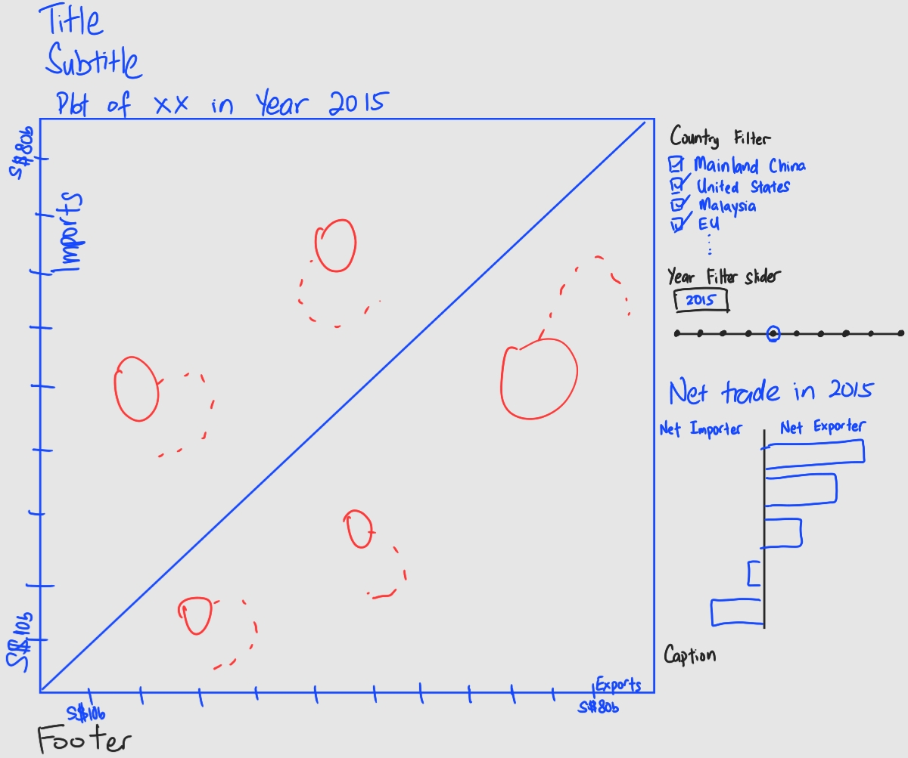
```

Figure \@ref(fig:sketch) would be an alternative presentation of the visualisation.

* The title of the visualisation will be renamed to provide more context to understand the visualisation.
* Subtitle will be added to provide background information on the context.
* The plot title will be added. The year will be dynamic and changed along with the year filter.
* The axis will include the export and import value with the appropriate currency with tick marks.
* Add Country and Year filter as the visualisation is interactive.
* Add tooltip description when hovered across to enhance the interactive of the visualisation.
* Additional horizontal bar plot to be added to the right of the visualisation.
    + The bar plot will indicate if the market is an net importer or net exporter in the particular year.
    + Include the title and context for the bar plot.
    + Change the color for the bar plot to differentiate between net importer and net exporter markets.
* Include caption to indicate the dataset source and date.
* Include footer if necessary to indicate any special information.

# 3. Proposed Data Visualisation using Tableau
The dataset used was retrieved from [Deparment of Statistics Singapore](https://www.singstat.gov.sg/) under the sub-section of [Merchandise Trade by Region/Market](https://www.singstat.gov.sg/find-data/search-by-theme/trade-and-investment/merchandise-trade/latest-data).

[Tableau Prep Builder 2021.1](https://www.tableau.com/products/prep) software is used for data preparation and [Tableau 2021.1](https://www.tableau.com/) is used for data visualisation.


## 3.1 Data Preparation
Upload the dataset into Tableau Prep Builder.

```{r import-step1, layout="1-body-outset", fig.align = 'center', fig.cap = 'Load the Import worksheet', echo=FALSE}
knitr::include_graphics("img/dataprep/import_step1.png")
```
**Refer to Figure \@ref(fig:import-step1) to import the dataset by following the steps below.**  <br />
1. Tick the box circled in red on the left. This option allows the Tableau Prep Builder to perform preliminary cleaning of the data. <br />
2. Drag the *T1* worksheet into the middle box. <br />
3. Rename the data to *Import*. <br />
4. Click the + button and create a *Pivot* node boxed in red.

```{r import-step2, layout="l-body-outset", fig.align = 'center', fig.cap = 'Pivot the data', echo=FALSE}
knitr::include_graphics("img/dataprep/import_step2.png")
```

**Refer to Figure \@ref(fig:import-step2) to Pivot and clean the data by following the steps below.** <br />
1. Drag all the months column header and drop to the *Pivoted Fields* section boxed in red. <br />
2. Change the new Pivoted Column to be a *Date* data type.
3. Rename the columns to *Import* and *Country* accordingly.
4. Select the *Country* column and perform a *Customer Split* boxed in green. 

```{r import-step3, layout="l-body-outset", fig.align = 'center', fig.cap = 'Create two new columns', echo=FALSE}
knitr::include_graphics("img/dataprep/import_step3.png")
```

**Refer to Figure \@ref(fig:import-step3) to create two new columns.**

1. In the custom split tab, input *(* into the field and split off at the *Last* word. (Follow as per red box on the left) This allows the new column to display only the words contained after the open bracket. In this case, we are splitting the column to get the *Denomination* of the trade value for each row. This is important in order to get the common import and export value of each market accurately. 
2. Similar, perform the same custom split but instead choose to split off at the *First* word.(Follow as per orange box on the right) This will display only the words before the open bracket. In this case, we are splitting to get the Country name only.

```{r import-step4, layout="l-body-outset", fig.align = 'center', fig.cap = 'Clean column header and label data type', echo=FALSE}
knitr::include_graphics("img/dataprep/import_step4.png")
```

**Refer to Figure \@ref(fig:import-step4) to remove the unwanted rows** 

1. Exclude the rows whose country are as follows:
* Total Merchandise Imports(Thousand Dollars)
* America(Million Dollars)
* Asia(Million Dollars)
* Europe(Million Dollars)
* Oceania(Million Dollars)
* Africa(Million Dollars)

2. As these variables does not reflect the market but the summation and continents, we exclude them prior to our analysis.

**Repeat the steps from Figure \@ref(fig:import-step1) to Figure \@ref(fig:import-step4) for Export using the *T2* worksheet.**

```{r import-step5, layout="l-body-outset", fig.align = 'center', fig.cap = 'Join both tables', echo=FALSE}
knitr::include_graphics("img/dataprep/import_step5.png")
```

**Refer to Figure \@ref(fig:import-step5) to Join both table** <br />
1. Drag the *Pivot* node from *Export* flow to the + button on the right of *Import* flow as shown in the red circle.

```{r import-step6, layout="l-body-outset", fig.align = 'center', fig.cap = 'Join two tables', echo=FALSE}
knitr::include_graphics("img/dataprep/import_step6.png")
```

**Refer to Figure \@ref(fig:import-step6) to change the parameters of the Join** <br />
1. Add two *Applied Join Clauses* to match variables *Date* and *Country* shown in the red box. <br />
2. Select the *Join Type* to *full* boxed in orange to include all countries into the final list. <br />
3. Remove the columns *Country(Country-1)*, *Date(Date-1)* and *Date(Date-1)*. These are duplicate or repeated columns after performing the *Join*.

```{r import-step7, layout="l-body-outset", fig.align = 'center', fig.cap = 'Output into csv', echo=FALSE}
knitr::include_graphics("img/dataprep/import_step7.png")
```

**Refer to Figure \@ref(fig:import-step7) to Pivot the columns** <br />
1. Create a new *Ouput* node  to the right side of the *Join*. <br />
2. Select the *Browse* button to change the directory and filename and change the *Output type* to *Comma Separated Values (.csv)* boxed in red. <br />

## 3.2 Data Visualisation
The data prepared earlier is uploaded into Tableau for Visualisation.

### 3.2.1 Create line plot for the 6 countries
The data contains import and export trade value of different markets from 1976 to 2021. Each market has the import and export value represented in different denomination. For example, *European Union* values is in *Million Dollars* whereas China is in *Thousand Dollars*. Hence, dummy variables will be created for import and export values by factoring in denomination.

```{r viz-step1, layout="l-body-outset", fig.align='center', fig.cap='Create Calculated field for import and export', echo=FALSE}
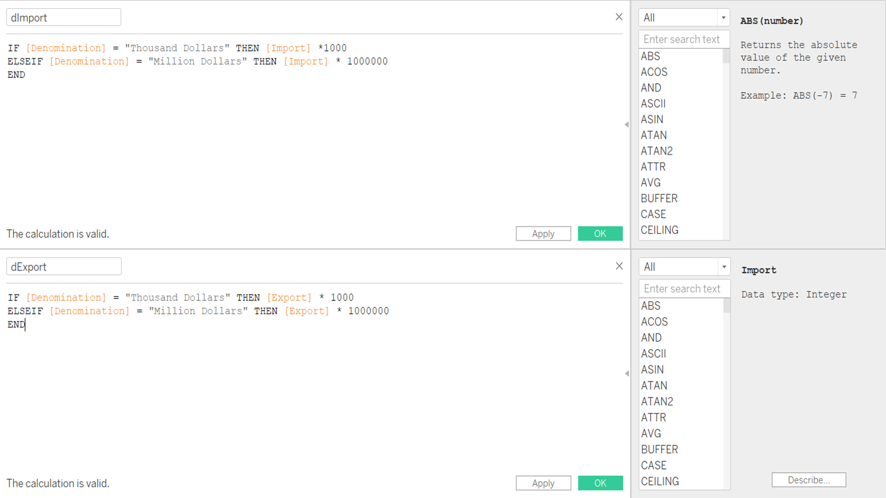
```

1. Select *Analysis* in the toolbar and select *Create calculated field*
2. Create a dummy variable *dImport* to tabulate the actual import value of the market factoring in the denomination.
3. Create a dummy variable *dExport* to tabulate the actual export value of the market factoring in the denomination.
4. Create a variable *Total* to tabulate the sum of export and import of the market.

```{r viz-step-2, fig.align='center', fig.cap='Create Calculated field for Net Export and Import', echo=FALSE}
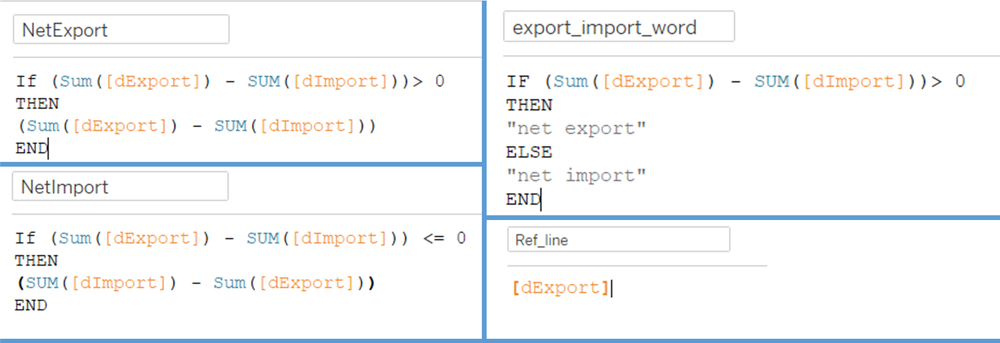
```

5. Create a variable *NetExport* to tabulate the net export value if the market total export value is more than their total import value for the year. This variable will only display values if the market has an net export value, else the variable will be empty for the market.
6. Create a variable *NetImport* to tabulate the net import value if the market total import value is more than their total export value for the year. This variable will only display values if the market has an net import value, else the variable will be empty for the market.
7. Create a variable *export_import_word* to display the string *net export* or *net import* depending on the markets value. This variable will be used in the tooltip description to reflect the market trade position. This variable will also be used in the barplot color to differentiate the market as a net exporter or net importer.
8. Create a variable *Ref_line* to plot the diagonal line across the plot. This will separate the region into two halves representing Net Exporter and Net Importer.

```{r viz-step-3, layout="l-page", fig.align='center', fig.cap = 'Bubble plot parameters', echo=FALSE}
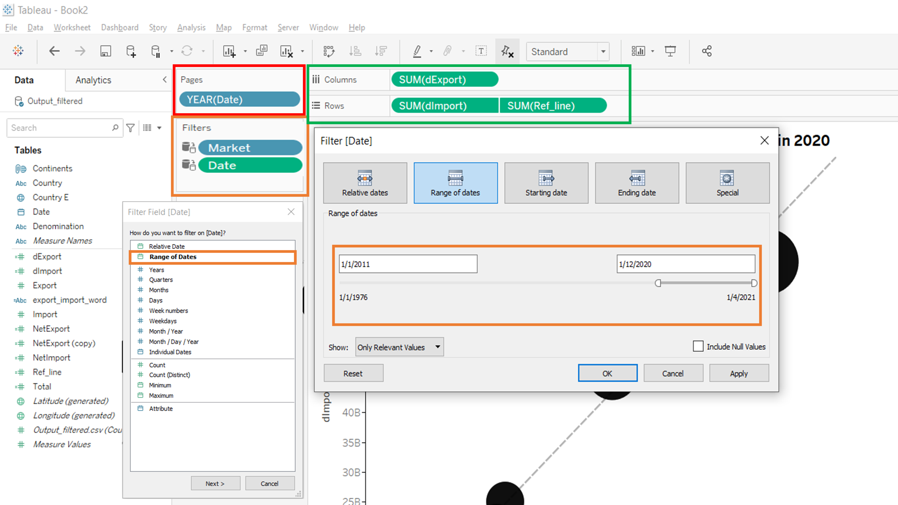
```

9. Insert *Date* into the *Pages* tab and set it to *Year* as shown in Figure \@ref(fig:viz-step-3) red box.
10. Insert *Country E* and *Date* into the *Filters* tab as boxed in orange.
* This will allow the visualisation to be interactive where users can select the markets they wish to be displayed.
* Select *Range of Dates* as the filter type for the *Date* as boxed in orange.
* Set the range of dates to start from *1/1/2011* to *1/12/2020* to ensure that the visualisation will only display the time period.
11. Insert *dExport* to *Columns* and *dImport* and *Ref_line* to Rows as boxed in green.
* The *Ref_line* is added to row to display the diagonal line across the plot.
* Set the *Ref_line* to dual axis and synchronize the axis with the main Y-axis. 
* Proceed to uncheck the *Show Header* option as there is no value to show the axis.

```{r viz-step-4, layout="l-body-outset", fig.align='center', fig.cap = 'Add diagonal dotted line' , echo=FALSE}
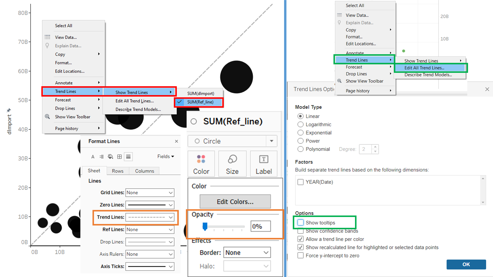
```

12. Right click on the plot and show the trend line for the variable *Ref_line* as shown in Figure \@ref(fig:viz-step-4) red box.
* Change the *Opacity* to 0% on the card for *SUM(Ref_line)*. This is to remove the visibility of the circles on the plot.
* Change the Trend lines to dotted dash line as shown in the orange box.
* Edit the trend lines by right clicking the plot and uncheck the *Show tooltips* option. This will eliminate any pop-up of data and information when users hover around the trend line. As this will be an interactive visualisation, we would like to eliminate unnecessary information to be displayed.

```{r viz-step5, layout="l-page", fig.align='center', fig.cap = 'Bubble plot interactive features', echo=FALSE}
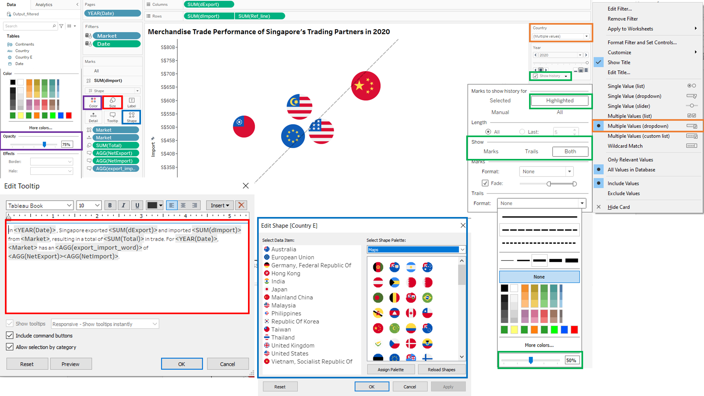
```

13.Change the card for *SUM(dImport)* to Shapes and change the shape to map each market to the respective flag.

* Download the flag icon and saved it into your Tableau locale repository. 
* Map the shapes to the flag icons accordingly by selecting shape that is boxed in blue.

14. Change the size of the bubble according to the *Total* trade value for each market.
15. Change the opacity to 75% for each bubble shape shown in the purple box.
16. Add tooltip comments to the bubbles to enhance the interactive information when users hover across each bubble as shown in the red box.
17. Change the filter for *Country* to *Multiple Values (dropdown)* as shown in the orange box. 
* This allows users to select multiple countries to be displayed in the plot for visualisation.

18. Check the box for *Show History* and show both *Marks* and *Trails* for *Highlighted* bubbles as boxed in green.
* Change the opacity for the *Marks* and *Trails* to 50%. This is to reduce cluttering by only giving a lighter shade of trails in the plot.
* This displays the movement trails of each bubble when the user animate over the years.
* Only highlighted bubbles will display the trails instead of all bubbles. This reduces cluttering of the plot and the trails will only appear when users specifically selected and highlight those bubbles.

19. Change the axis name to *Import* and *Export* and format the axis to show the currency and tick marks.
* Fix the end of each axis to S$83bn. This will ensure that both scales are equal and the diagonal line is at a 45 degree angle.
20. Rename the Title of the plot and include dynamic display of the year. This will change the Year to match the Year accordingly to the users adjustment of the filter.

Figure \@ref(fig:viz-bubble) below shows the layout in Tableau for the Bubble Plot.

```{r viz-bubble, layout="l-page", fig.align = 'center', fig.cap = 'Final Bubble Plot layout', echo=FALSE}
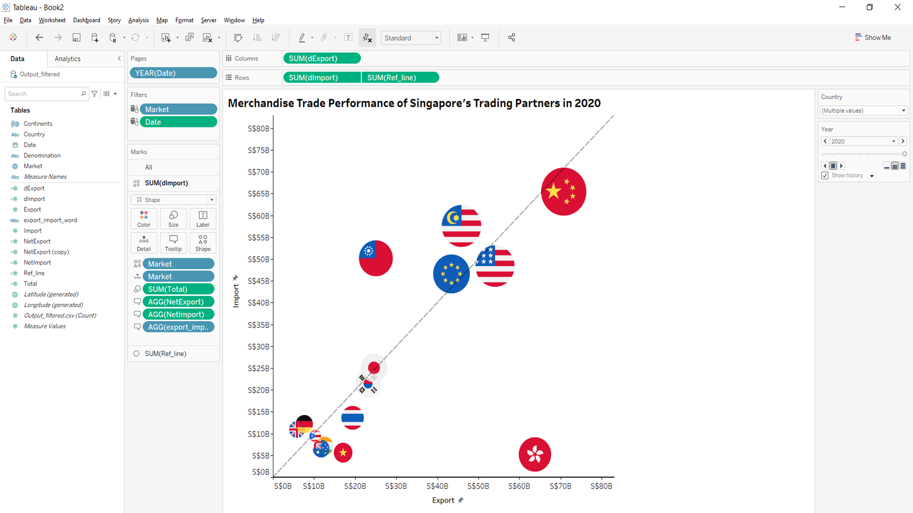
```

### 3.2.2 Create Horizontal Bar Chart for Net Import and Net Export
1. Create a *Bar* chart in a new worksheet

```{r viz-step1-1, layout="l-body-outset", fig.align = 'center', fig.cap = 'Create Horizontal Bar plot', echo=FALSE}
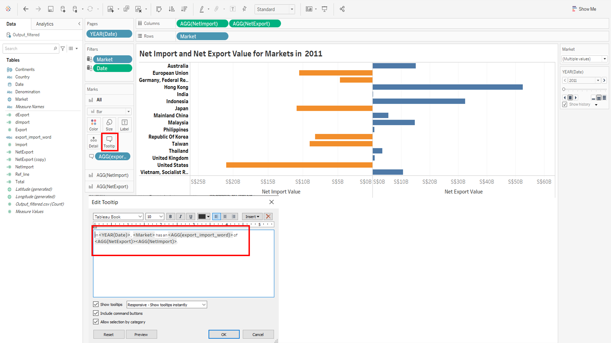
```
2. Repeat steps 9 and 10 in sub-section 3.1.1 to include the same Filters and Pages.
3. Add *Market* to Rows and *NewImport* and *NetExport* to Columns.
4. Change the color of the bar plot to differentiate between Net Import and Net Export value.
5. Add tooltip comments as per the red box in Figure \@ref(fig:viz-step1-1). This allows interactive information to appear when users hover on the barplot, displaying the market and if the it is a net export or import and the corresponding value.
6. Change the axis name to *Net Import Value* and *Net Export Value* and format the axis to show the currency and tick marks.
* Change the axis scale to *Reversed* for *Net Import Value* on the left. This will display and start the horizontal bar plot from the middle ground to the left. 
7. Change the Title per Figure \@ref(fig:viz-step1-1) and include dynamic display of the year. This will change the Year to match the Year accordingly to the users adjustment of the filter.

Figure \@ref(fig:viz-bar) below shows the layout in Tableau for the horizontal Bar Plot.

```{r viz-bar, layout="l-page", fig.align = 'center', fig.cap = 'Final Bar Chart layout', echo=FALSE}
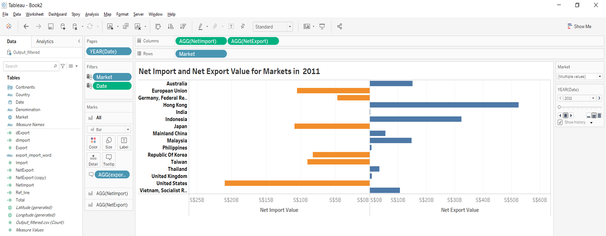
```

### 3.2.3 Create Horizontal Bar Chart for Total Import and Total Export
1. Create a *Bar* chart in a new worksheet

```{r viz-step1-2, layout="l-body-outset", fig.align = 'center', fig.cap = 'Create Horizontal Bar plot for total export and import', echo=FALSE}
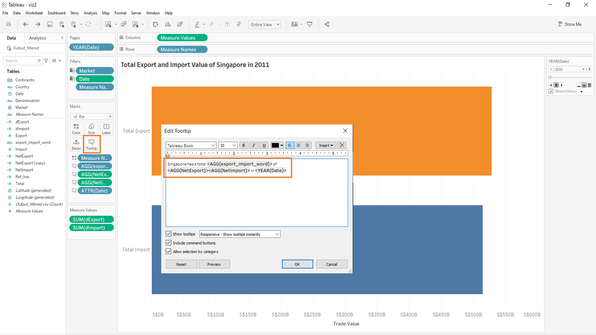
```
2. Repeat steps 9 and 10 in sub-section 3.1.1 to include the same Filters and Pages.
3. Add *Measure Values* to Columns and *Measure Names* to Rows. 
* Filter the Measure Names to include only *dExport* and *dImport*.
* Add the sum of *dExport* and *dImport* into the *Measure Values*
* This will create a stacked bar chart to show the total import and export values for the selected market in the year.
4. Add tooltip and include the following description boxed in orange.
5. Change the x-axis to *Trade Value* and format it to be in Singapore Dollars in Billions.
6. Change the Title per Figure \@ref(fig:viz-step1-2) and include dynamic display of the year. This will change the Year to match the Year accordingly to the users adjustment of the filter.

### 3.2.4 Create Dashboard
1. Create a new Dashboard.

```{r viz-dashboard-1, layout="l-body-outset", fig.align = 'center', fig.cap = 'Dashboard wireframe', echo=FALSE}
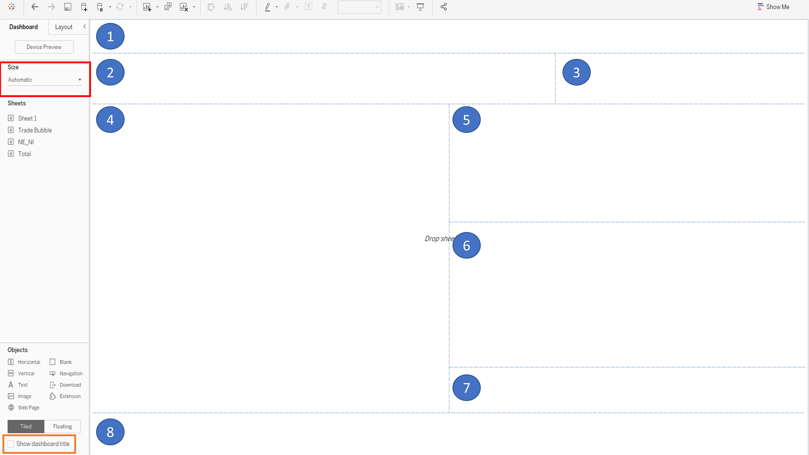
```

2. Setup the wireframe for the dashboard by referring to Figure \@ref(fig:viz-dashboard-1) and the following steps.
    + Change the dashboard *Size* to *Automatic* boxed in red.
    + Check the option for *Show dashboard title* boxed in orange to display Title in section **1** of the wireframe.
    + Insert *Horizontal* and *Vertical* objects as shown in Figure \@ref(fig:viz-dashboard-1) for section 2 to 8.
3. Drag and drop the bubble plot worksheet *Trade Bubble* to sub section **4** in Figure \@ref(fig:viz-dashboard-1).
4. Drag and drop the bar chart worksheet *NE_NI* to sub section **5** in Figure \@ref(fig:viz-dashboard-1).
5. Drag and drop the bar chart worksheet *Total* to sub section **6** in Figure \@ref(fig:viz-dashboard-1).
6. Move the global filter for date and markets to sub section **3**.
7. Change the Title of the dashboard.
8. Add subtitle to provide context for visualisation at sub section **2**.
9. Add caption to include source and date of data at sub section **7**.
10. Add footer to include the metadata definition and exclusion of data at sub section **8**.

```{r viz-dashboard-2, layout="l-page", fig.align = 'center', fig.cap = 'Final Dashboard', echo=FALSE}
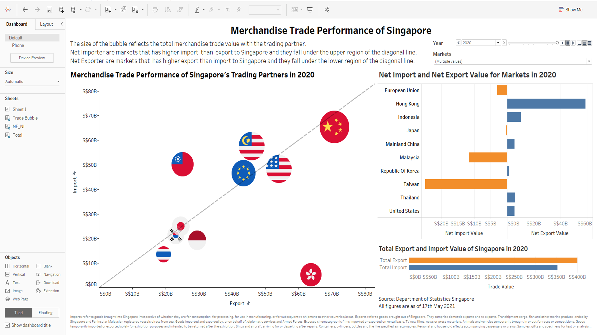
```

Figure \@ref(fig:viz-dashboard-2) is the final template of the visualisation. The filters on the top right corner is able to control and toggle all 3 plots. To enhance the interactivity of the visualisation, actions is added to link the bubble plot to the individual market bar plot. 

```{r viz-dashboard-3, layout="l-page", fig.align = 'center', fig.cap = 'Final Dashboard', echo=FALSE}
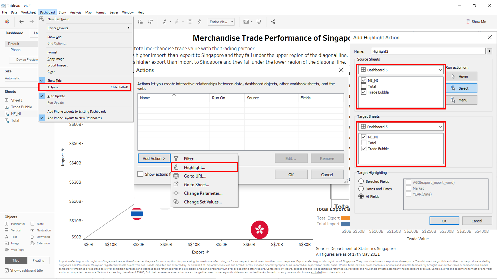
```

**Refer to Figure \@ref(fig:viz-dashboard-3) to add actions to the visualisation**

1. Click *Dashboard* in the toolbar and select *Actions*.
2. In the *Actions* menu, add action and select *Highlight*
* This allows selection of markets in the bar plot to be automatically highlight the bubble plot markets and vice versa.
3, Uncheck the *Total* worksheet. 
* The *Total* worksheet is uncheck because the worksheet has no direct separation of information linked to the markets.

The final interactive visualisation is available on my [Tableau Public](https://public.tableau.com/app/profile/lim.yong.kai/viz/viz2_16238675163570/Dashboard5) page.

```{r , layout="l-page"}
knitr::include_url("https://public.tableau.com/app/profile/lim.yong.kai/viz/viz2_16238675163570/Dashboard5")
```

The interactive features of the visualisation are as follows:

1. The dropdown multiple selection filter for markets will update the entire visualisation by changing all 3 plots together.
2. The dropdown and slider filter for year will change the data and the year in the titles accordingly. 
3. Highlighting the bubble of each market will show the trail marks of the movement from 2011 to the user selected year.The highlighted markets will also be linked to the bar plot displaying the individual markets net export and net import value.
4. Hovering the cursor over the bubble plot will display the tooltip information on the market export, import and net import or export value in the particular year.
5. Hovering the cursor over the total export and import bar plot will display the tooltip information on the total export and import value of Singapore with the selected markets in the particular year.


# 4.0 Insights from visualisation
A positive trade balance is termed when Singapore export value is greater than import value with a country. This signifies an inflow of cash to Singapore from other markets Conversely, an negative trade balance is termed when Singapore import value is greater than export value with another market This signifies an outflow of cash from Singapore to the market.

1. Import and export values are increasing over the years with China. Export grew from S$49B to S$71B and import grew from S$46B to S$65B from 2011 to 2020. China overtook Malaysia in total trade value in 2013 and has been Singapore's largest trading partner up till 2020. 
2. Singapore maintain a high net export value with Hong Kong from the 2011 to 2020. This is mainly due to very low import value compared to a much higher proportion in export value.
3. On the contrary, the value of imports grew at a much faster pace than exports with Taiwan, increasing the net import value value in 2011 to 2020.
4. Exports fell drastically with Indonesia from S$57B to S$30B from 2011 to 2020. However, even with huge fall in export with Indonesia, Indonesia still maintains as an net exporter with Singapore.
5. United States transited into a net exporter in 2020 after being a net importer from 2011 to 2019. This signifies that Singapore exported more to the United States in 2020.
6. Over the past five years, Singapore has around S$40B in net exports annually. This positioned Singapore as an net exporter, signifying an inflow of cash to Singapore from other markets. This shows that Singapore balance of trade is in a trade surplus, which is important for Singapore economy who depends heavily on trade to be successful.