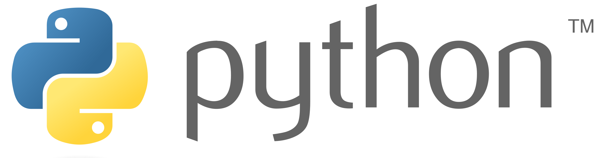

### Some of the Software and skills I am learning~ 
[{width=80px}](https://www.r-project.org/)

* Data manipulation and transformation using *tidyverse*
* Visualisation using *ggplot* and *shiny* application
* Confirmatory Data Analysis using statistical tests
* Predictive Analytics with Regression models 

[{width=180px}](https://www.python.org/)

* Data manipulation and transformation using *numpy*
* Visualisation using *ggplot* and *seaborn*

[{width=80px}](https://www.jmp.com/en_us/software/predictive-analytics-software.html)

#### JMP Pro, SAS
* Exploratory and Confirmatory Data Analysis using statistical test
* Clustering analysis with Hierarchical, K-means and latent class analysis algorthims

[{width=80px}](https://www.sas.com/en_sg/software/enterprise-miner.html)

#### SAS Enterprise Miner
* Regression and Recursive partitioning modeling
* Time series analysis (Dynamic Time Warping)

[{width=220px}](https://www.tableau.com/)

* Visusalisation using interactive dashboards

